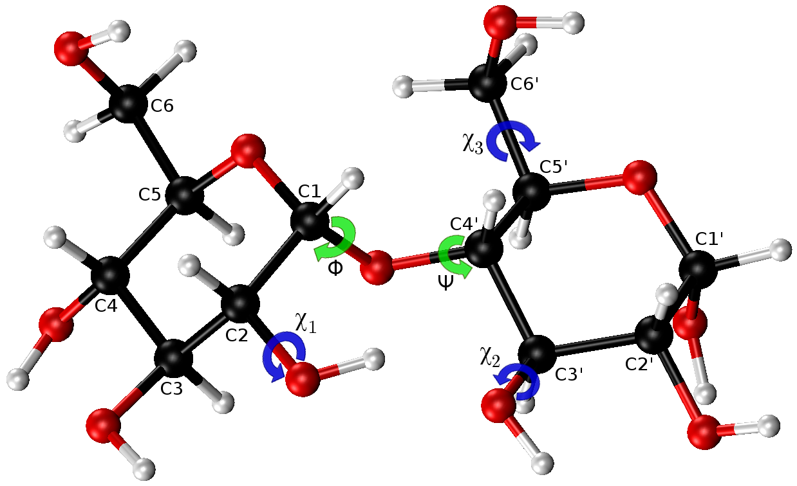

# *Che*Sweet

[](https://travis-ci.org/BIOS-IMASL/chesweet)
[](http://joss.theoj.org/papers/5d4b945f9d9cbb2c0761c1b3a9d2cc66)

*Che*Sweet: chemical shifts for glycans  

The knowledge of the tridimensional structure of glycans is necessary to understand in detail, at atomic level, the molecular processes in which they are involved. Chemical Shifts (CS) are observables obtained from Nuclear Magnetic Resonance experiments that are highly sensitive probes to sense conformational changes. CS can be calculated accurately using quantum chemical tools, although these computations are very demanding for routine computations of more than a few conformations. For that reason we have developed *Che*Sweet, a Python module for accurate and fast computation of CS.

## Installing

### Requirements

*Che*Sweet requires:
- Python (>=3.3)
- Numpy (>= 1.8.2)
- Scipy (>= 0.13.3)

This packages will be automatically installed if you don't have them yet.

### Installation

#### Version 1

1. Download this repository and unzip it. 

2. Execute the following command in your terminal:
 
```
pip install chesweet-master/
```

#### Version 2

1. Clone this repository

2. Execute the following command in your terminal:

```
pip install chesweet/
```

## Testing

After installation is done you can run the automatic tests (optional), you will need to have `pytest` package installed, depending on the way that you downloaded the folder run:

```
cd chesweet-master
```

**or**

```
cd chesweet
```

And then run the test with:  
```
pytest
```

This will check that all functions of *Che*Sweet work in your installation. You can also use the `nose` package instead of `pytest`.

## Using *Che*Sweet

### Import module
```python
import chesweet as chsw
```

### Load look-up tables (lut)
The main argument of `load` is `full`. Passing `False` (default) is useful when working with the glycosidic torsional angles phi (Φ), psi (Ψ), and omega (Ω), `True` allows you to work with the mentioned torsional angles and also included the chi (*Χ*) torsionals. In the image below you can see the mentioned torsional angles for α-D-Glcp-(1-4)-α-D-Glcp.  

<p align="center">

</p>

The names of the disaccharides used by *Che*Sweet follow the IUPAC syntax, but without the parentheses in the bond, e.g. for maltose the IUPAC name is a-D-Glcp-(1-4)-a-D-Glcp, *Che*Sweet uses a-D-Glcp-1-4-a-D-Glcp.

Examples:  
Load **all calculated dissacharides** in *Che*Sweet:  

```python
# Reduced version of the datasets (using only phi, psi and omega)
disaccharides_red = chsw.CheSweet()

# Using full=True (using all torsionals)
disaccharides_full = chsw.CheSweet(full=True)
```

You have the option of changing the location of the folder `lut`, in that case, you have to indicate the new location on the argument `path`.  

Once you have loaded the look-up tables it is possible to calculate the chemical shifts or the torsional that you want.  
In the next examples we show how to use these functions for maltose \[α-D-Glcp-(1-4)-α-D-Glcp].

### Calculate chemical shifts from torsional values (using `compute_cs()` function)

Using the reduced look-up table you have to provide the name of the disaccharide and the values of Φ and Ψ torsionals:  

```python
chemC1_red, chemCx_red = maltose_red.compute_cs('a-D-Glcp-1-4-a-D-Glcp', 85.3, 76.8)
print(chemC1_red, chemCx_red)
102.852047 76.693767
```

When using the full look-up table you have to also provide the *Χ* torsional angles:

```python
# Using full=True
chemC1_full, chemCx_full = maltose_full.compute_cs('a-D-Glcp-1-4-a-D-Glcp', 85.3, 76.8, 46.8, 78.6, 173.1)
print(chemC1_full, chemCx_full)
101.85525 72.19692
```

You can see in these examples that depending on the datasets used (reduced or full) the obtained result can have little differences (Garay et. al 2014).

### Obtain torsional list from CS values (using `compute_tors()` function)

This example is the inverse of the previous one. We are now passing the CS for the carbons involved in the glycosidic bond and we are getting the compatible torsional angles given a tolerance `eps`, by default `eps=0.5`. The first CS should be C1 and the second CS should be the second carbon in the glycosidic bond.

```python
# Reduced version of the datasets
tors_array_red = maltose_red.compute_tors('a-D-Glcp-1-4-a-D-Glcp', 109.52, 87.68)
print(tors_array_red)
[[  90.  120.]
 [ 110.  100.]
 [ 130.  130.]
 [ 140.  100.]]
```
In this case, we obtain information only about Φ and Ψ, first and second column respectively.
You can obtain more values for these torsionals by increasing the value of the parameter `eps` (by default 0.5):  

```python
# augmented eps
tors_array_red2 = maltose_red.compute_tors('a-D-Glcp-1-4-a-D-Glcp', 109.52, 87.68, eps=0.6)
print(tors_array_red2)
[[  90.  120.]
 [ 100.  110.]
 [ 110.  100.]
 [ 130.   90.]
 [ 130.  130.]
 [ 140.  100.]]
```

Alternatively, you can use the full datasets.  

```python
# Using full=True
tors_array_full = maltose_full.compute_tors('a-D-Glcp-1-4-a-D-Glcp', 109.52, 87.68)
print(tors_array_full)
[[  80.  120.  -60.  180.  -60.]
 [  90.  110.  180.  180.  -60.]
 [  90.  110.  -60.   60.   60.]
 [  90.  120.  -60.  -60.  -60.]
 [  90.  130.  180.   60.  -60.]
 [ 100.  100.  180.  180.  -60.]
 [ 100.  130.   60.  180.  180.]
 [ 110.   90.  180.  180.  -60.]
 [ 110.  100.  -60.  -60.  -60.]
 [ 110.  130.   60.  180.  180.]
 [ 110.  160.   60.   60.   60.]
 [ 110.  160.  180.   60.   60.]
 [ 120.  100.   60.   60.  -60.]
 [ 130.  100.   60.   60.  -60.]
 [ 130.  140.  180.   60.   60.]
 [ 140.  130.  -60.  -60.  -60.]]
```

You can see in these examples that depending on the datasets used (reduced or full) the obtained result can have little differences and be using the full version of the dataset you have additional information about the *Χ* angles.  

#### Format of the look-up table files

For each look-up table file (lut file, for short) the last two columns are the values of the pre-calculated CS. The first of that columns corresponds to the C1 and the last correspond to the second carbon in the glycosidic bond (Cx). The remaining columns are the torsional angles.  

There are two types of lut files for each disaccharide, one type (called *"full"*) includes all the torsional angles (lut files with the name of the disaccharide) and the other type (called *"reduce"*) only includes the torsionals of the glycosidic bond (lut files with the name ended with "_red"). Which of this files is used in the calculation is controlled with the keyword `full`. 

Last 4 lines in the file "a-D-Glcp-1-1-a-D-Glcp", the header with the columns names is not present in the actual lut files and is show here only to help identify the content of each column:  
```
  phi psi  chi1 chi2 nan  nan    C1 CS    C1' CS
 -10  130  -60  -60    0    0    87.3016  87.6553
 -10  140   60   60    0    0    85.9775  86.1810
 -10  140  180   60    0    0    86.0382  85.3786
 -10  140  -60   60    0    0    84.7857  85.0489
```

Here the chi1 belongs to the first residue and chi2 to the second residue

Last 4 lines in the file "a-D-Glcp-1-4-a-D-Glcp":  
```
  phi psi  chi1 chi2  chi3  nan  C1 CS    C4' CS
 -10  130  180  -60  -60    0    89.1629 117.2891
 -10  130  -60   60  -60    0    88.2327 117.6398
 -10  130  -60  180  -60    0    88.2642 115.4036
 -10  130  -60  -60  -60    0    87.5465 116.9395
```

Here chi1 belongs to the first residue and chi2-chi3 to the second residue

Last 4 lines in the file "a-D-Glcp-1-6-a-D-Glcp":  
```
  phi psi  chi1 chi2  chi3  nan  C1 CS   C6' CS
 -10  -90  180  180  -60    0    85.2663 114.0324
 -10  -90  180  -60   60    0    84.0807 113.5660
 -10  -90  180  -60  180    0    84.9781 113.5554
 -10  -90  180  -60  -60    0    83.9020 113.9225
```
 
The columns with all-zeros are not used in the calculations, these columns are just placeholders in case a dissacharide with an additional torsional angle is included in the future.

In contrast to the full lut files, that have a variable number of columns all reduced lut files have 4 columns, except for 1-6 glycosidic bonds were an omega angle included, as you can see below.

First 4 lines in the file "a-D-Glcp-1-4-a-D-Glcp_red":  
```
  phi psi  C1 CS   C4' CS
 -10  100  89.6864 116.5005
 -10  110  90.2366 114.8895
 -10  120  89.9299 116.8816
 -10  130  89.0696 116.8426
```

Last 4 lines in the file "a-D-Glcp-1-6-a-D-Glcp_red":  
```
  phi psi omega C1 CS   C6' CS
 -10 -110  180  85.9299 117.8878
 -10 -100   60  84.3075 119.8173
 -10 -100  180  85.5578 115.8875
 -10  -90  180  85.0815 113.8175
```

## Support

If you need help in using this package or you found a bug please open an Issue.

## Contributing

All contributions are welcome!  
You can contribute via GitHub, send your proposed changes with your Pull Requests and the errors/improvements/comments must be reported by Issues.

## References

Garay, P. G., Martin, O. A., Scheraga, H. A., & Vila, J. A. (2014). Factors affecting the computation of the $^{13}$C shielding in disaccharides. Journal of Computational Chemistry, 35(25), 1854–1864. https://doi.org/10.1002/jcc.23697

## License

This project is licensed under the MIT License - see the [LICENSE](LICENSE) file for details.
